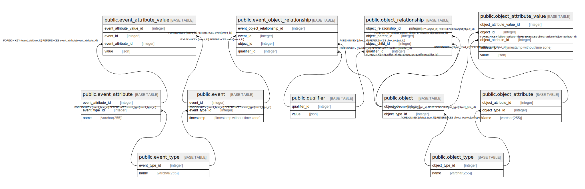

# ocelv2

## Tables

| Name                                                                    | Columns | Comment | Type       |
|-------------------------------------------------------------------------|---------|---------|------------|
| [public.event](public.event.md)                                         | 3       |         | BASE TABLE |
| [public.event_attribute](public.event_attribute.md)                     | 3       |         | BASE TABLE |
| [public.event_attribute_value](public.event_attribute_value.md)         | 4       |         | BASE TABLE |
| [public.event_object_relationship](public.event_object_relationship.md) | 4       |         | BASE TABLE |
| [public.event_type](public.event_type.md)                               | 2       |         | BASE TABLE |
| [public.object](public.object.md)                                       | 2       |         | BASE TABLE |
| [public.object_attribute](public.object_attribute.md)                   | 3       |         | BASE TABLE |
| [public.object_attribute_value](public.object_attribute_value.md)       | 5       |         | BASE TABLE |
| [public.object_relationship](public.object_relationship.md)             | 4       |         | BASE TABLE |
| [public.object_type](public.object_type.md)                             | 2       |         | BASE TABLE |
| [public.qualifier](public.qualifier.md)                                 | 2       |         | BASE TABLE |

## Relations

---

> Generated by [tbls](https://github.com/k1LoW/tbls)
