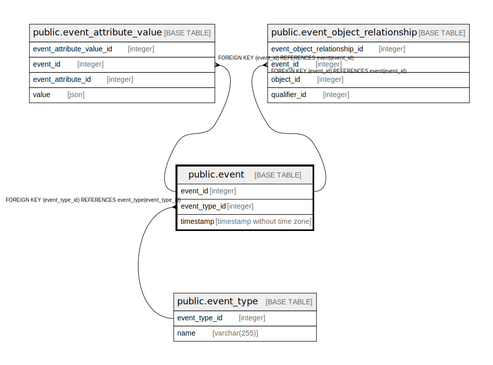

# public.event

## Description

## Columns

| Name          | Type                        | Default                                 | Nullable | Children                                                                                                                                | Parents                                   | Comment |
|---------------|-----------------------------|-----------------------------------------|----------|-----------------------------------------------------------------------------------------------------------------------------------------|-------------------------------------------|---------|
| event_id      | integer                     | nextval('event_event_id_seq'::regclass) | false    | [public.event_attribute_value](public.event_attribute_value.md) [public.event_object_relationship](public.event_object_relationship.md) |                                           |         |
| event_type_id | integer                     |                                         | false    |                                                                                                                                         | [public.event_type](public.event_type.md) |         |
| timestamp     | timestamp without time zone |                                         | false    |                                                                                                                                         |                                           |         |

## Constraints

| Name                     | Type        | Definition                                                       |
|--------------------------|-------------|------------------------------------------------------------------|
| event_pkey               | PRIMARY KEY | PRIMARY KEY (event_id)                                           |
| event_event_type_id_fkey | FOREIGN KEY | FOREIGN KEY (event_type_id) REFERENCES event_type(event_type_id) |

## Indexes

| Name       | Definition                                                            |
|------------|-----------------------------------------------------------------------|
| event_pkey | CREATE UNIQUE INDEX event_pkey ON public.event USING btree (event_id) |

## Relations

---

> Generated by [tbls](https://github.com/k1LoW/tbls)
