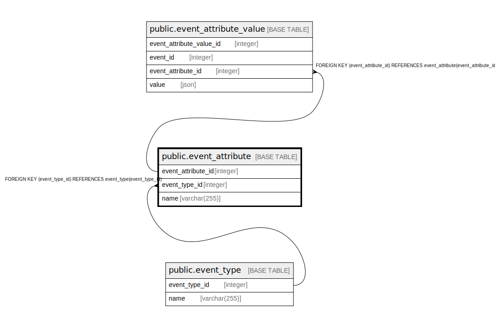

# public.event_attribute

## Description

## Columns

| Name               | Type         | Default                                                     | Nullable | Children                                                        | Parents                                   | Comment |
|--------------------|--------------|-------------------------------------------------------------|----------|-----------------------------------------------------------------|-------------------------------------------|---------|
| event_attribute_id | integer      | nextval('event_attribute_event_attribute_id_seq'::regclass) | false    | [public.event_attribute_value](public.event_attribute_value.md) |                                           |         |
| event_type_id      | integer      |                                                             | false    |                                                                 | [public.event_type](public.event_type.md) |         |
| name               | varchar(255) |                                                             | false    |                                                                 |                                           |         |

## Constraints

| Name                               | Type        | Definition                                                       |
|------------------------------------|-------------|------------------------------------------------------------------|
| event_attribute_pkey               | PRIMARY KEY | PRIMARY KEY (event_attribute_id)                                 |
| event_attribute_event_type_id_fkey | FOREIGN KEY | FOREIGN KEY (event_type_id) REFERENCES event_type(event_type_id) |

## Indexes

| Name                 | Definition                                                                                          |
|----------------------|-----------------------------------------------------------------------------------------------------|
| event_attribute_pkey | CREATE UNIQUE INDEX event_attribute_pkey ON public.event_attribute USING btree (event_attribute_id) |

## Relations

---

> Generated by [tbls](https://github.com/k1LoW/tbls)
