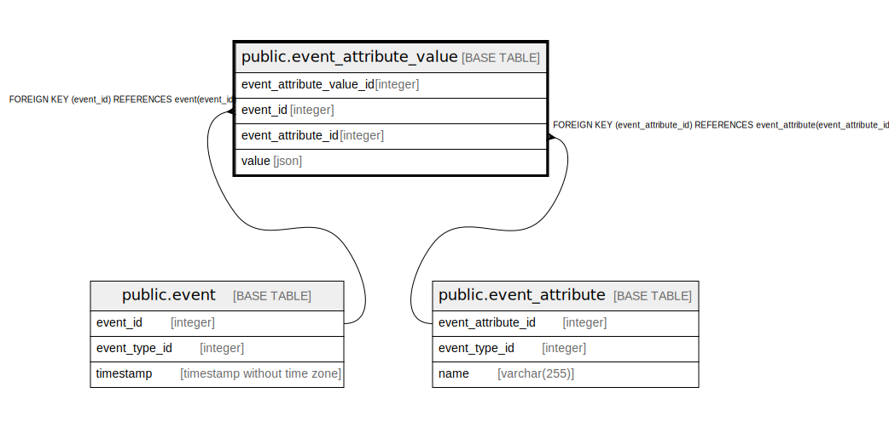

# public.event_attribute_value

## Description

## Columns

| Name                     | Type    | Default                                                                 | Nullable | Children | Parents                                             | Comment |
|--------------------------|---------|-------------------------------------------------------------------------|----------|----------|-----------------------------------------------------|---------|
| event_attribute_value_id | integer | nextval('event_attribute_value_event_attribute_value_id_seq'::regclass) | false    |          |                                                     |         |
| event_id                 | integer |                                                                         | false    |          | [public.event](public.event.md)                     |         |
| event_attribute_id       | integer |                                                                         | false    |          | [public.event_attribute](public.event_attribute.md) |         |
| value                    | json    |                                                                         | false    |          |                                                     |         |

## Constraints

| Name                                          | Type        | Definition                                                                      |
|-----------------------------------------------|-------------|---------------------------------------------------------------------------------|
| event_attribute_value_event_attribute_id_fkey | FOREIGN KEY | FOREIGN KEY (event_attribute_id) REFERENCES event_attribute(event_attribute_id) |
| event_attribute_value_pkey                    | PRIMARY KEY | PRIMARY KEY (event_attribute_value_id)                                          |
| event_attribute_value_event_id_fkey           | FOREIGN KEY | FOREIGN KEY (event_id) REFERENCES event(event_id)                               |

## Indexes

| Name                       | Definition                                                                                                            |
|----------------------------|-----------------------------------------------------------------------------------------------------------------------|
| event_attribute_value_pkey | CREATE UNIQUE INDEX event_attribute_value_pkey ON public.event_attribute_value USING btree (event_attribute_value_id) |

## Relations

---

> Generated by [tbls](https://github.com/k1LoW/tbls)
