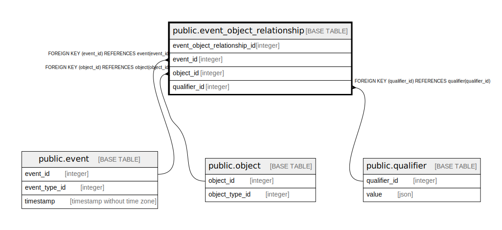

# public.event_object_relationship

## Description

## Columns

| Name                         | Type    | Default                                                                         | Nullable | Children | Parents                                 | Comment |
|------------------------------|---------|---------------------------------------------------------------------------------|----------|----------|-----------------------------------------|---------|
| event_object_relationship_id | integer | nextval('event_object_relationship_event_object_relationship_id_seq'::regclass) | false    |          |                                         |         |
| event_id                     | integer |                                                                                 | false    |          | [public.event](public.event.md)         |         |
| object_id                    | integer |                                                                                 | false    |          | [public.object](public.object.md)       |         |
| qualifier_id                 | integer |                                                                                 | false    |          | [public.qualifier](public.qualifier.md) |         |

## Constraints

| Name                                        | Type        | Definition                                                    |
|---------------------------------------------|-------------|---------------------------------------------------------------|
| event_object_relationship_pkey              | PRIMARY KEY | PRIMARY KEY (event_object_relationship_id)                    |
| event_object_relationship_event_id_fkey     | FOREIGN KEY | FOREIGN KEY (event_id) REFERENCES event(event_id)             |
| event_object_relationship_object_id_fkey    | FOREIGN KEY | FOREIGN KEY (object_id) REFERENCES object(object_id)          |
| event_object_relationship_qualifier_id_fkey | FOREIGN KEY | FOREIGN KEY (qualifier_id) REFERENCES qualifier(qualifier_id) |

## Indexes

| Name                           | Definition                                                                                                                        |
|--------------------------------|-----------------------------------------------------------------------------------------------------------------------------------|
| event_object_relationship_pkey | CREATE UNIQUE INDEX event_object_relationship_pkey ON public.event_object_relationship USING btree (event_object_relationship_id) |

## Relations

---

> Generated by [tbls](https://github.com/k1LoW/tbls)
