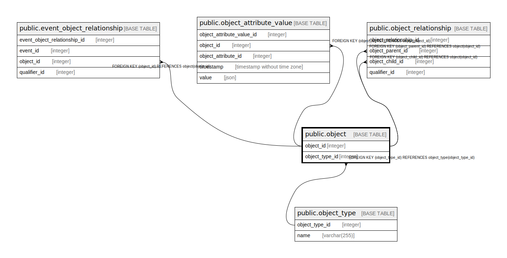

# public.object

## Description

## Columns

| Name           | Type    | Default                                   | Nullable | Children                                                                                                                                                                                              | Parents                                     | Comment |
|----------------|---------|-------------------------------------------|----------|-------------------------------------------------------------------------------------------------------------------------------------------------------------------------------------------------------|---------------------------------------------|---------|
| object_id      | integer | nextval('object_object_id_seq'::regclass) | false    | [public.event_object_relationship](public.event_object_relationship.md) [public.object_attribute_value](public.object_attribute_value.md) [public.object_relationship](public.object_relationship.md) |                                             |         |
| object_type_id | integer |                                           | false    |                                                                                                                                                                                                       | [public.object_type](public.object_type.md) |         |

## Constraints

| Name                       | Type        | Definition                                                          |
|----------------------------|-------------|---------------------------------------------------------------------|
| object_pkey                | PRIMARY KEY | PRIMARY KEY (object_id)                                             |
| object_object_type_id_fkey | FOREIGN KEY | FOREIGN KEY (object_type_id) REFERENCES object_type(object_type_id) |

## Indexes

| Name        | Definition                                                               |
|-------------|--------------------------------------------------------------------------|
| object_pkey | CREATE UNIQUE INDEX object_pkey ON public.object USING btree (object_id) |

## Relations

---

> Generated by [tbls](https://github.com/k1LoW/tbls)
