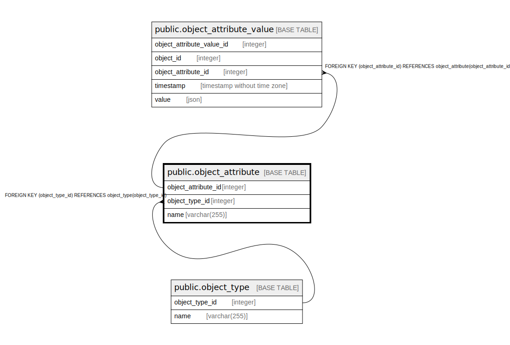

# public.object_attribute

## Description

## Columns

| Name                | Type         | Default                                                       | Nullable | Children                                                          | Parents                                     | Comment |
|---------------------|--------------|---------------------------------------------------------------|----------|-------------------------------------------------------------------|---------------------------------------------|---------|
| object_attribute_id | integer      | nextval('object_attribute_object_attribute_id_seq'::regclass) | false    | [public.object_attribute_value](public.object_attribute_value.md) |                                             |         |
| object_type_id      | integer      |                                                               | false    |                                                                   | [public.object_type](public.object_type.md) |         |
| name                | varchar(255) |                                                               | false    |                                                                   |                                             |         |

## Constraints

| Name                                 | Type        | Definition                                                          |
|--------------------------------------|-------------|---------------------------------------------------------------------|
| object_attribute_pkey                | PRIMARY KEY | PRIMARY KEY (object_attribute_id)                                   |
| object_attribute_object_type_id_fkey | FOREIGN KEY | FOREIGN KEY (object_type_id) REFERENCES object_type(object_type_id) |

## Indexes

| Name                  | Definition                                                                                             |
|-----------------------|--------------------------------------------------------------------------------------------------------|
| object_attribute_pkey | CREATE UNIQUE INDEX object_attribute_pkey ON public.object_attribute USING btree (object_attribute_id) |

## Relations

---

> Generated by [tbls](https://github.com/k1LoW/tbls)
