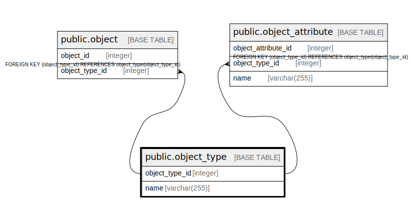

# public.object_type

## Description

## Columns

| Name           | Type         | Default                                             | Nullable | Children                                                                                | Parents | Comment |
|----------------|--------------|-----------------------------------------------------|----------|-----------------------------------------------------------------------------------------|---------|---------|
| object_type_id | integer      | nextval('object_type_object_type_id_seq'::regclass) | false    | [public.object](public.object.md) [public.object_attribute](public.object_attribute.md) |         |         |
| name           | varchar(255) |                                                     | false    |                                                                                         |         |         |

## Constraints

| Name             | Type        | Definition                   |
|------------------|-------------|------------------------------|
| object_type_pkey | PRIMARY KEY | PRIMARY KEY (object_type_id) |

## Indexes

| Name             | Definition                                                                              |
|------------------|-----------------------------------------------------------------------------------------|
| object_type_pkey | CREATE UNIQUE INDEX object_type_pkey ON public.object_type USING btree (object_type_id) |

## Relations

---

> Generated by [tbls](https://github.com/k1LoW/tbls)
