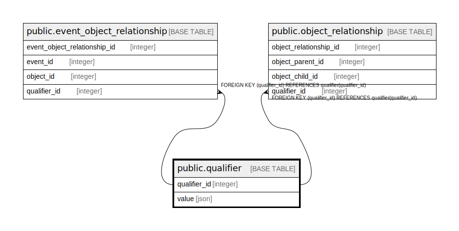

# public.qualifier

## Description

## Columns

| Name         | Type    | Default                                         | Nullable | Children                                                                                                                            | Parents | Comment |
|--------------|---------|-------------------------------------------------|----------|-------------------------------------------------------------------------------------------------------------------------------------|---------|---------|
| qualifier_id | integer | nextval('qualifier_qualifier_id_seq'::regclass) | false    | [public.event_object_relationship](public.event_object_relationship.md) [public.object_relationship](public.object_relationship.md) |         |         |
| value        | json    |                                                 | false    |                                                                                                                                     |         |         |

## Constraints

| Name           | Type        | Definition                 |
|----------------|-------------|----------------------------|
| qualifier_pkey | PRIMARY KEY | PRIMARY KEY (qualifier_id) |

## Indexes

| Name           | Definition                                                                        |
|----------------|-----------------------------------------------------------------------------------|
| qualifier_pkey | CREATE UNIQUE INDEX qualifier_pkey ON public.qualifier USING btree (qualifier_id) |

## Relations

---

> Generated by [tbls](https://github.com/k1LoW/tbls)
