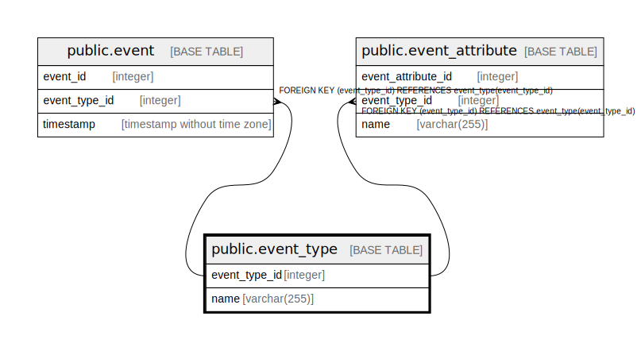

# public.event_type

## Description

## Columns

| Name          | Type         | Default                                           | Nullable | Children                                                                            | Parents | Comment |
|---------------|--------------|---------------------------------------------------|----------|-------------------------------------------------------------------------------------|---------|---------|
| event_type_id | integer      | nextval('event_type_event_type_id_seq'::regclass) | false    | [public.event](public.event.md) [public.event_attribute](public.event_attribute.md) |         |         |
| name          | varchar(255) |                                                   | false    |                                                                                     |         |         |

## Constraints

| Name            | Type        | Definition                  |
|-----------------|-------------|-----------------------------|
| event_type_pkey | PRIMARY KEY | PRIMARY KEY (event_type_id) |

## Indexes

| Name            | Definition                                                                           |
|-----------------|--------------------------------------------------------------------------------------|
| event_type_pkey | CREATE UNIQUE INDEX event_type_pkey ON public.event_type USING btree (event_type_id) |

## Relations

---

> Generated by [tbls](https://github.com/k1LoW/tbls)
