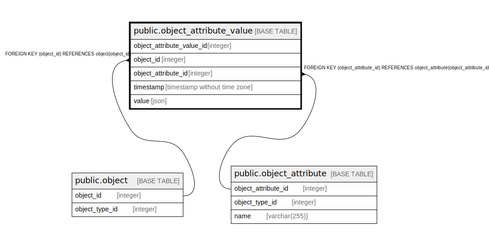

# public.object_attribute_value

## Description

## Columns

| Name                      | Type                        | Default                                                                   | Nullable | Children | Parents                                               | Comment |
|---------------------------|-----------------------------|---------------------------------------------------------------------------|----------|----------|-------------------------------------------------------|---------|
| object_attribute_value_id | integer                     | nextval('object_attribute_value_object_attribute_value_id_seq'::regclass) | false    |          |                                                       |         |
| object_id                 | integer                     |                                                                           | false    |          | [public.object](public.object.md)                     |         |
| object_attribute_id       | integer                     |                                                                           | false    |          | [public.object_attribute](public.object_attribute.md) |         |
| timestamp                 | timestamp without time zone |                                                                           | false    |          |                                                       |         |
| value                     | json                        |                                                                           | false    |          |                                                       |         |

## Constraints

| Name                                            | Type        | Definition                                                                         |
|-------------------------------------------------|-------------|------------------------------------------------------------------------------------|
| object_attribute_value_object_attribute_id_fkey | FOREIGN KEY | FOREIGN KEY (object_attribute_id) REFERENCES object_attribute(object_attribute_id) |
| object_attribute_value_pkey                     | PRIMARY KEY | PRIMARY KEY (object_attribute_value_id)                                            |
| object_attribute_value_object_id_fkey           | FOREIGN KEY | FOREIGN KEY (object_id) REFERENCES object(object_id)                               |

## Indexes

| Name                        | Definition                                                                                                               |
|-----------------------------|--------------------------------------------------------------------------------------------------------------------------|
| object_attribute_value_pkey | CREATE UNIQUE INDEX object_attribute_value_pkey ON public.object_attribute_value USING btree (object_attribute_value_id) |

## Relations

---

> Generated by [tbls](https://github.com/k1LoW/tbls)
