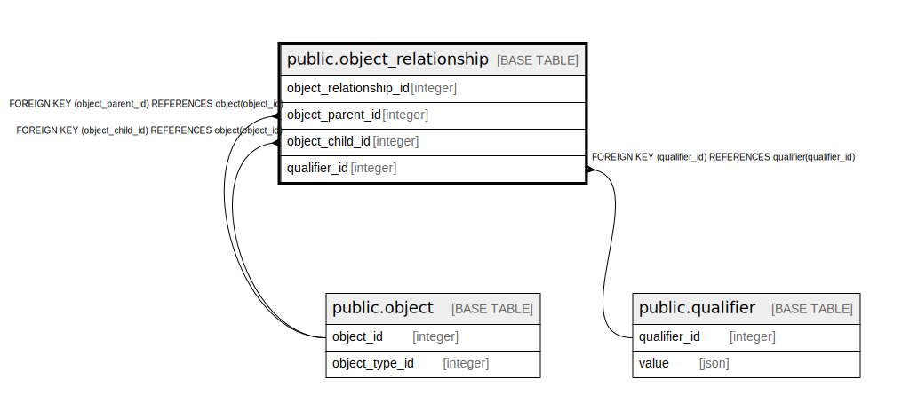

# public.object_relationship

## Description

## Columns

| Name                   | Type    | Default                                                             | Nullable | Children | Parents                                 | Comment |
|------------------------|---------|---------------------------------------------------------------------|----------|----------|-----------------------------------------|---------|
| object_relationship_id | integer | nextval('object_relationship_object_relationship_id_seq'::regclass) | false    |          |                                         |         |
| object_parent_id       | integer |                                                                     | false    |          | [public.object](public.object.md)       |         |
| object_child_id        | integer |                                                                     | false    |          | [public.object](public.object.md)       |         |
| qualifier_id           | integer |                                                                     | true     |          | [public.qualifier](public.qualifier.md) |         |

## Constraints

| Name                                      | Type        | Definition                                                    |
|-------------------------------------------|-------------|---------------------------------------------------------------|
| fk_object_hierarchy                       | UNIQUE      | UNIQUE (object_parent_id, object_child_id)                    |
| object_relationship_object_child_id_fkey  | FOREIGN KEY | FOREIGN KEY (object_child_id) REFERENCES object(object_id)    |
| object_relationship_object_parent_id_fkey | FOREIGN KEY | FOREIGN KEY (object_parent_id) REFERENCES object(object_id)   |
| object_relationship_pkey                  | PRIMARY KEY | PRIMARY KEY (object_relationship_id)                          |
| object_relationship_qualifier_id_fkey     | FOREIGN KEY | FOREIGN KEY (qualifier_id) REFERENCES qualifier(qualifier_id) |

## Indexes

| Name                     | Definition                                                                                                            |
|--------------------------|-----------------------------------------------------------------------------------------------------------------------|
| fk_object_hierarchy      | CREATE UNIQUE INDEX fk_object_hierarchy ON public.object_relationship USING btree (object_parent_id, object_child_id) |
| object_relationship_pkey | CREATE UNIQUE INDEX object_relationship_pkey ON public.object_relationship USING btree (object_relationship_id)       |

## Relations

---

> Generated by [tbls](https://github.com/k1LoW/tbls)
